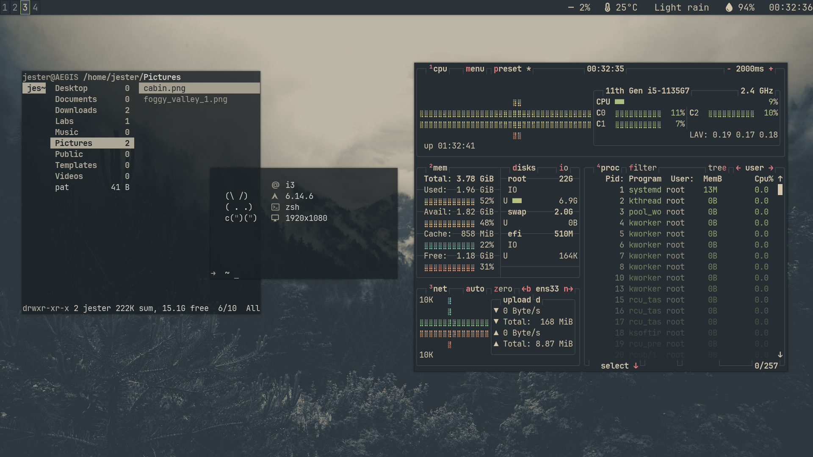

# ✨ AEGIS Dotfiles — My Arch Linux Setup

---

## 🖥️ System Overview

| Component        | Tool                                            |
|------------------|------------------------------------------------|
| **WM**           | `i3wm`                                         |
| **Bar**          | `i3bar` + `i3blocks`                           |
| **Terminal**     | `xfce4-terminal`                               |
| **Shell**        | `zsh` + [Oh My Zsh](https://ohmyz.sh/)         |
| **Compositor**   | `picom`                                        |
| **Font**         | [JetBrains Mono Nerd Font](https://www.nerdfonts.com/font-downloads) |
| **File Manager** | `ranger`                                       |

---

## 📁 Features

- 🌓 Subtle transparency and shadow via Picom
- 🎨 Nerd fonts for beautiful icons & glyphs
- 🐚 Zsh with productivity plugins and clean theme
- 📦 Easily portable for fresh Arch installs

---

